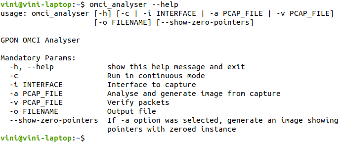
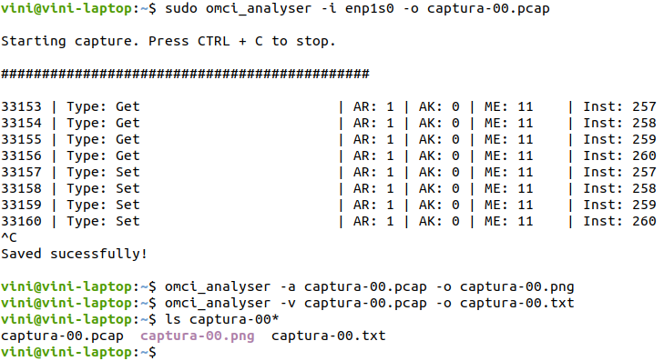

# OMCI Analyser

Projeto desenvolvido como Trabalho de Conclusão de Curso do curso de Engenharia de Telecomunicações do Instituto Federal de Santa Catarina campus São Jose (IFSC-SJ), cujo tema é definido por: Desenvolvimento de Ferramenta para Captura e Análise de Pacotes OMCI em Redes GPON.

O software desenvolvido possui três módulos: capturador, analisador e verificador. Que serão descritos a seguir.

 

## Instalação

Para instalar, basta fazer o download do projeto e executar o "./install".

Disponível somente para Linux e testado somente com Ubuntu 18.04.
Requisitos: Python3

 

## Utilização

Após a instalação, o comando omci_analyser estará disponvível. Utilize a opção -h para mostrar a ajuda.

 

### Módulo capturador

Captura pacotes com Ethertype 0x88b5 (Local Experimental) a partir da interface selecionada. Remove o cabeçalho ethernet e interpreta  o restante como quadro OMCI. Utiliza-se a seguinte sintaxe:

    # sudo omci_analyser -i <interface> -o <output-file>

O parâmetros são descritos como:

 - **interface:** interface de rede de onde serão capturados os pacotes
 - **output-file:** nome do arquivo de saída da captura (a saida será no formato .pcap)

**Obs.:** necessário executar como super usuário, devido as permissões de acesso a interface de rede.

 

### Módulo Analisador

Este módulo realiza uma análise dos pacotes OMCI de uma determinada captura. Ele identifica as entidades OMCI e desenha um diagrama mostrando a relações que foram percebidas. Utiliza-se a seguinte sintaxe:

    # omci_analyser -a <input-file> -o <output-file>

O parâmetros são descritos como:

 - **input-file:** nome do arquivo a ser analisado, que deve estar no formato .pcap.
 - **output-file:** nome do arquivo de saida. Sera gerada imagem no formato .png.

 

### Módulo Verificador

Este módulo realiza verificações dos pacotes OMCI de uma determinada captura. Ele identifica as entidades OMCI e executa atualmente tres checagens:

 - Verificação de atributos obrigatorios: checa quais atributos obrigatórios com permissão de escrita não foram setados pela OLT;
 - Verificação do tamanho das MEs: verifica as MEs que estão com tamanho diferente do esperado;
 - Verificação de atributos configurados sem permissão: verifica se a OLT tentou configurar atributos que nao possuem permissão de escrita.

Utiliza-se a seguinte sintaxe para execução das verificações:

    # omci_analyser -v <input-file> -o <output-file>

O parâmetros são descritos como:

 - **input-file:** nome do arquivo a ser verificado, que deve estar no formato .pcap.
 - **output-file:** nome do arquivo de saida. Sera gerado arquivo no formato .txt com o resultado das três verificações.

 

### Exemplo de Execução

A imagem a seguir mostra a execução dos três módulos em sequência. Primeiro e executado o capturador, depois realizada uma análise e por fim, uma verificação.

 

### Execução em Modo Contínuo

Também é possível executar o programa em modo contínuo, para isto, execute o seguinte comando:

    # sudo omci_analyser -c

**Obs.:** necessário executar como super usuário, devido as permissões de acesso a interface de rede.
